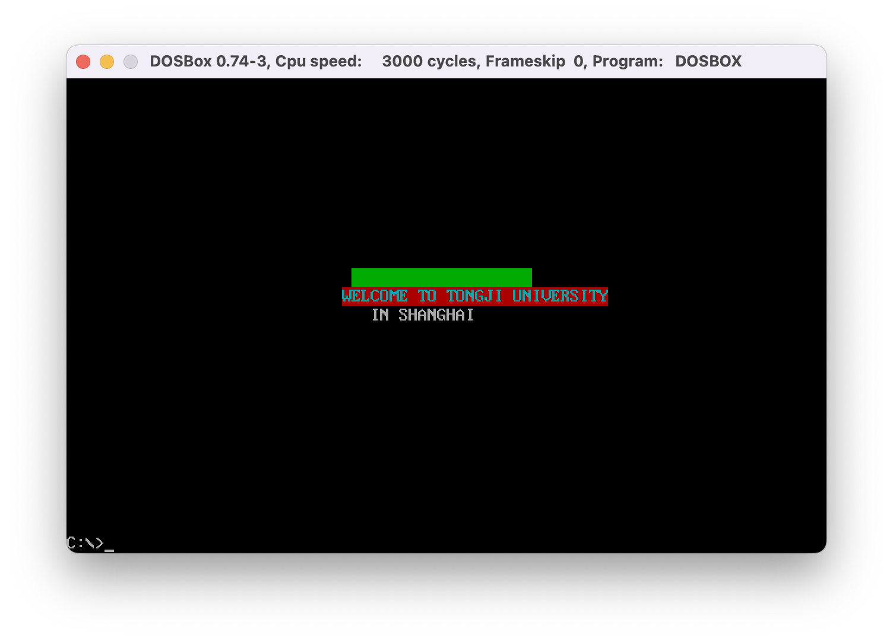
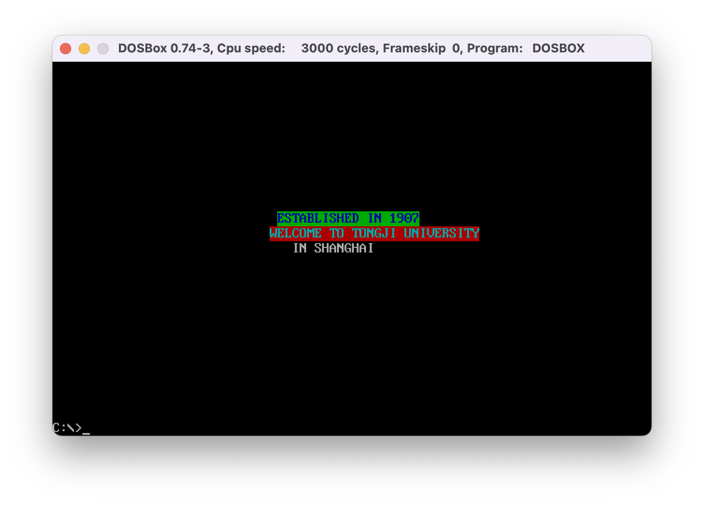

# ASM
2022 大三 汇编

[作业一-等差数列求和](#作业一-等差数列求和)

[作业二-乘法表](#作业二-乘法表)

[作业三-函数调用](#作业三-函数调用)

[作业四-拆分子程序](#作业四-拆分为三个文件)

[作业五-屏幕显示](#作业五-屏幕显示)


## 作业一 等差数列求和
时间：2022.10.16

### 实现
1. 使用loop实现循环
2. 使用div实现十六进制数到十进制数的转换


### 收获
1. 了解了汇编语言中循环的实现
2. 将寄存器中的十六进制数转换为十进制数输出，使用除法指令

## 作业二 乘法表
时间：2022.10.20

### 1. 输出乘法表
1. 使用push/pop实现二重循环


### 2. 乘法表纠错
1. lea指令的使用
2. 函数调用的使用


## 作业三 函数调用
时间：2022.10.26

### 1. 键盘输入年月日，输出年月日
1. 使用函数调用实现
2. 了解了0ah中断的使用


## 作业四 拆分为三个文件
时间：2022.11.13
1. 使用public和extrn实现(遇到的问题比较多)
2. 使用include实现
    - 使用include实现时，只需要编译a1.asm即可，不需要编译a2.asm和a3.asm
    - 然后输入link a1.obj
3. 遇到的问题
    - fixup overflow
        - 原因：跳转的地址超过了2字节的范围
        - 解决：使用call far ptr
    - 重定义
        - 原因：include之后，data段是共享的，所以会出现重定义的问题
        - 解决：使用extrn声明
4. 宏定义的写法(之后补上)


## 作业五 屏幕显示
时间：2022.11.20  
### 实现  
1. 确定字符显示的位置
    - 在80*25的彩色字符模式显示缓冲区在内存地址的B8000H~BFFFFH共32KB的空间中
    - 在该模式下，显示器可以显示25行，80列，所以在一行中就有80个字符，共占据160个字节，每个字符低位字节存储字符的ASCII码，高位字节存储字符的颜色属性
    - 偏移0000~009F对应的就是显示器上的第一行；
    - 偏移0A00~13F0对应的就是显示器上的第二行；

2. 确定字符显示的颜色
    - 属性字节的格式如下
    > 7  (6 5 4) 3 (2 1 0)

    > BL (R G B) I (R G B)
    
    > BL: 1表示闪烁，0表示不闪烁
    
    > I: 1表示反色，0表示正常
    
    > R G B: 3位二进制数，表示红绿蓝三种颜色的强度，0表示强度最低，1表示强度最高

    > 例如：0FH表示白色，0BH表示蓝色，0DH表示绿色，0EH表示红色
    
    - 颜色例子
      - 绿底黑色 0 010 0 000B (20H)
      - 绿底红色 0 010 0 100B (24H)
      - 白底蓝色 0 111 0 001B (71H)

3. 清屏功能
   - 将显示缓冲区的内容清零，即将显示缓冲区的每个字节都设置为0

4. 显示字符串功能
   - 设置颜色
   - 将字符串中的每个字符显示到显示缓冲区中


### 效果



### 遇到的问题
1. DATA段中定义多个字符串，EQU不能获得正确的字符串长度
```asm
STR1 DB 'Hello World!',0
STR2 DB 'Hello World!',0
STR3 DB 'Hello World!',0
STR1_LEN EQU $-STR1
STR2_LEN EQU $-STR2
STR3_LEN EQU $-STR3
```

2. 使用MACRO时，其中存在循环的标签时，多次调用该宏，会出现重定义问题