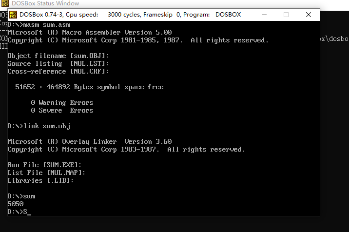
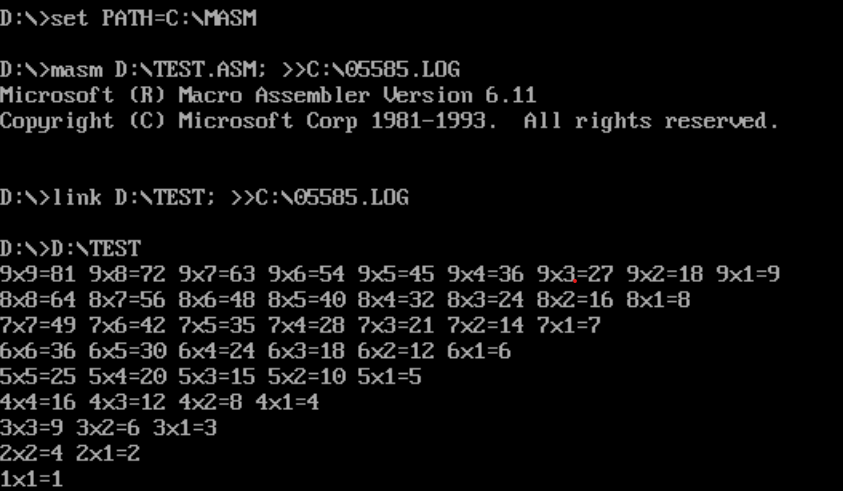
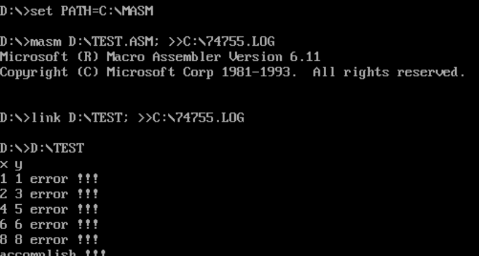
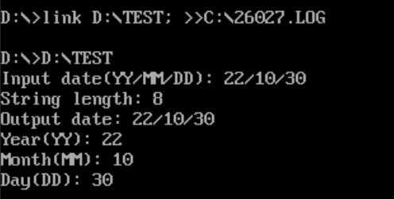
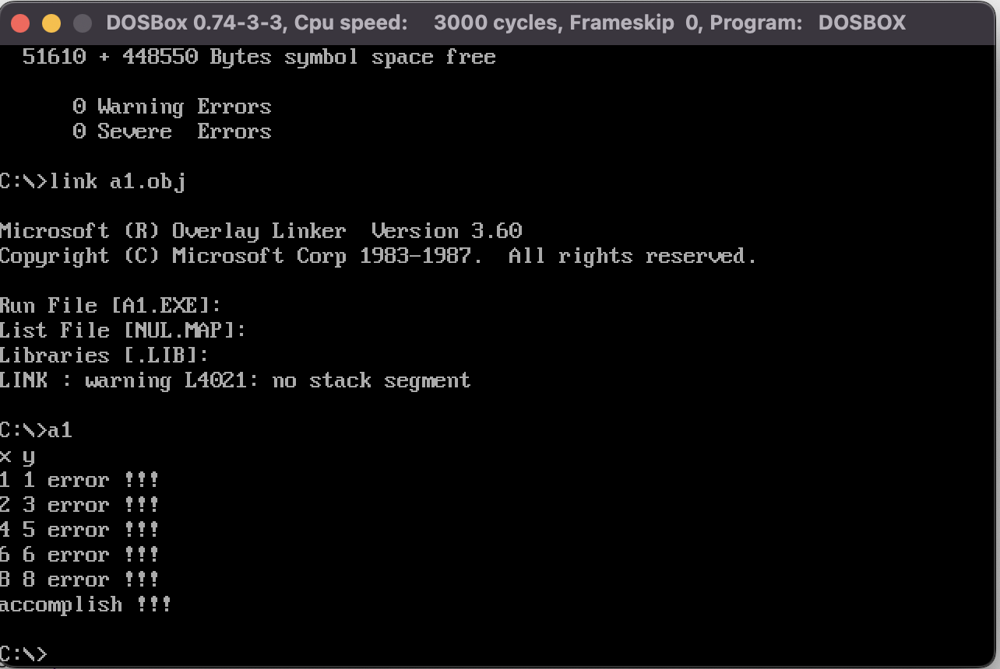

# ASM
2022 大三 汇编

## 作业一 等差数列求和
时间：2022.10.16

### 实现
1. 使用loop实现循环
2. 使用div实现十六进制数到十进制数的转换

### 收获
1. 了解了汇编语言中循环的实现
2. 将寄存器中的十六进制数转换为十进制数输出，使用除法指令

## 作业二 乘法表
时间：2022.10.20

### 1. 输出乘法表
1. 使用push/pop实现二重循环

### 2. 乘法表纠错
1. lea指令的使用
2. 函数调用的使用

## 作业三 函数调用
时间：2022.10.26

### 1. 键盘输入年月日，输出年月日
1. 使用函数调用实现
2. 了解了0ah中断的使用

## 作业四 拆分为三个文件
时间：2022.11.13
1. 使用public和extrn实现(遇到的问题比较多)
2. 使用include实现
    - 使用include实现时，只需要编译a1.asm即可，不需要编译a2.asm和a3.asm
    - 然后输入link a1.obj
3. 遇到的问题
    - fixup overflow
        - 原因：跳转的地址超过了2字节的范围
        - 解决：使用call far ptr
    - 重定义
        - 原因：include之后，data段是共享的，所以会出现重定义的问题
        - 解决：使用extrn声明
4. 宏定义的写法(之后补上)
